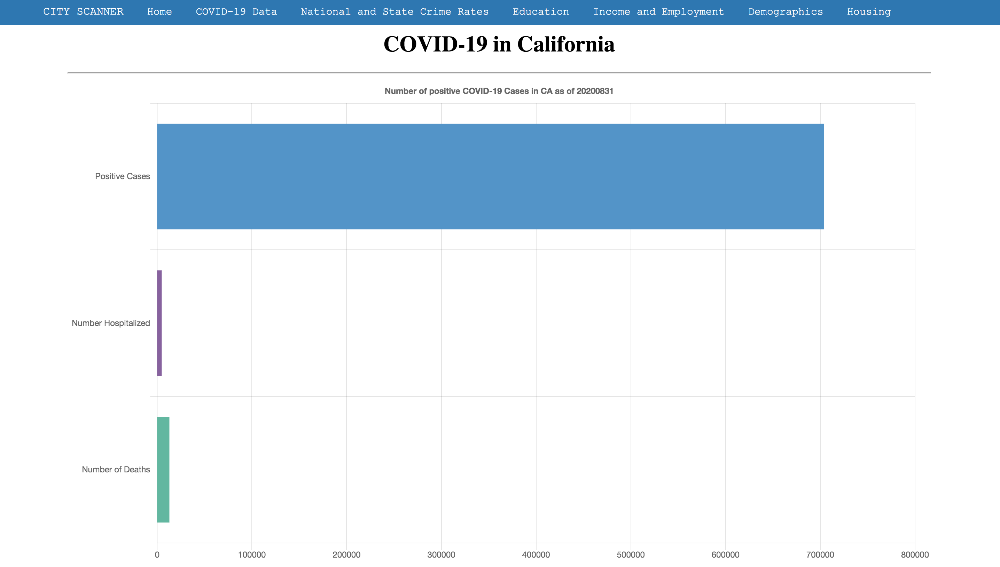
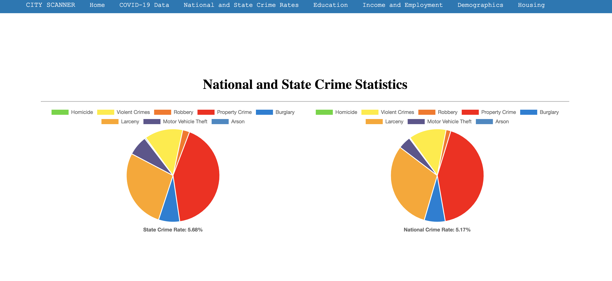
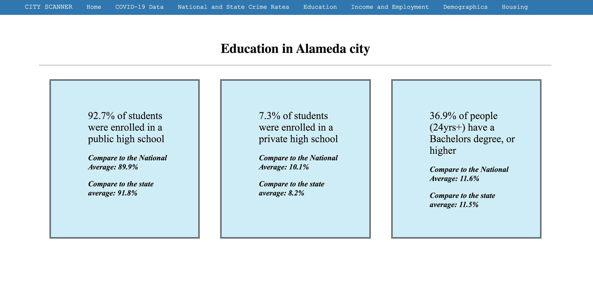

# City-Scanner
<ul>
  
  <li>Link to live app: https://daniellerussell-beep.github.io/City-Scanner/</li>
  <li>Link to GitHub Repository: https://github.com/DanielleRussell-beep/City-Scanner.git</li>
  
  </ul>

<h2> Landing Page </h2>

Users are prompted to select a U.S. state, followed by a city.

Current COVID-19 data is displayed to the user based on the state selection.

Crime statistics are displayed to the user based on the state selection, with a national average comparison next to it.

Demographics, such as education, are displayed to the user based on the city selection.

<h2>Summary</h2>

City Scanner allows users to find a U.S. state and city, and discover statistics within that area.

<h3>Technologies Used</h3>
<ul>
  <li>HTML</li>
  <li>CSS</li>
  <li>Javascript</li>
  <li>jQuery</li>
  <li>Chart.js</li>
